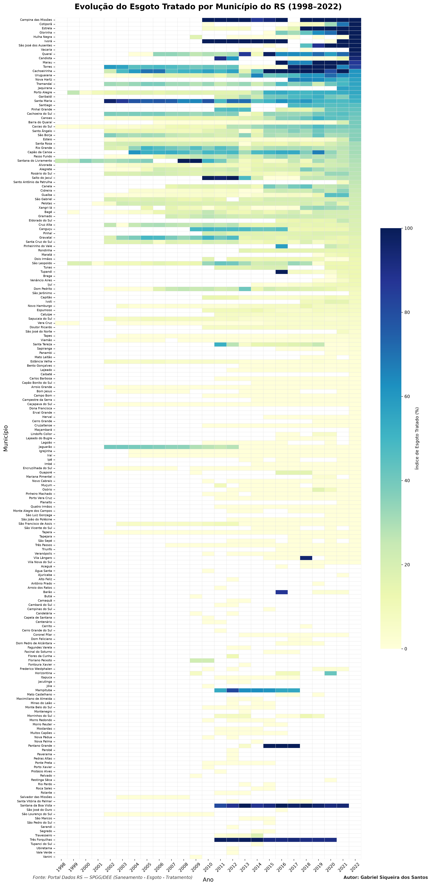

Apresenta a evolução histórica do percentual de esgoto tratado em relação à água consumida em 1997 municípios do RS (1998–2022).

• Visualização: 

• Metodologia: Mapa de calor bidimensional ordenado de forma decrescente pelo desempenho em 2022.

• Tecnologias: Python 3.13 (Pandas, NumPy, Matplotlib, Seaborn).

• Como Reproduzir: Instale as dependências (pip install pandas numpy matplotlib seaborn), mantenha o arquivo efluente_agua_consumida.csv e execute python codigo.py.

• Créditos: Autor: Gabriel Siqueira dos Santos | Fonte: Portal de Dados Abertos do RS (Dados RS) (SPGG/DEE).